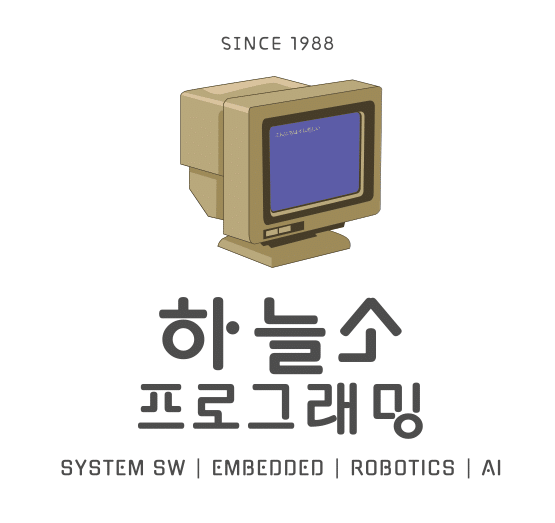

<h3 align="center">
    
     
     
    <h1 align="center"> 하늘소</h1>
</h3>

<h5 align="center">
    KNU IT대학 SW 전공동아리
     
    Since 1988
</h5>

## 2주차 교육과정

- Created : 23/08/26
- Last Modified : 23/08/26
- 최종 수정자 : 박건하

### 01. 교육과정 목표

기본적인 자료구조 구현

1. C언어 원시 자료형 및 구조체에 대한 이해
2. 프로세스 메모리 구조에 대한 이해
3. 자료구조 및 추상 자료형에 대한 이해
4. Stack 구현
5. Queue 구현

### 02. Keywords

> **교육과정 공통사항** :  
> 아래 안내된 방법 순서대로 진행하되, 어떤 방법을 사용하셔도 무방합니다.
> 안내된 레퍼런스 외에 자료는 Keywords에 있는 단어들을 검색 후 자료를 찾아보시기 바랍니다.

    C 포인터, C 구조체, 운영체제 프로세스 메모리 구조, 자료구조, 스택, 큐

### 03. 세부내용 안내

> **안내사항** :  
> 아래 백준문제를 C언어로 구현하시면 됩니다.

1. Stack 구현 : https://www.acmicpc.net/problem/10828
2. Queue 구현 : https://www.acmicpc.net/problem/10845

### 04. 제출 결과물 안내 및 통과기준

- 10828 문제 풀이
- 10845 문제 풀이
  > **10828, 10845 설명은 각 코드 내 주석 첨부로 대체**
  > 10828, 10845 문제 정답 유무 스크린샷 첨부.
- 작성한 코드가 컴퓨터에서 어떻게 실행되는지 설명 | 개인별 자료 준비 및 미팅(3분 내외)
- **위 모든 파일을 본인 Github 레포지토리에 업로드 후 확인 연락 바람**
- **통과기준 : 코드 제출 및 미팅 후 기준 충족 시 통과**

## Reference

- 프로세스 메모리 구조 : https://everybe-ok.tistory.com/15
- 프로세스 메모리 구조 : https://haesoo9410.tistory.com/296
- 프로그램 실행 순서 : https://alex-blog.tistory.com/145
- stack reference : https://www.geeksforgeeks.org/stack-data-structure/
- queue reference : https://www.geeksforgeeks.org/queue-data-structure/
